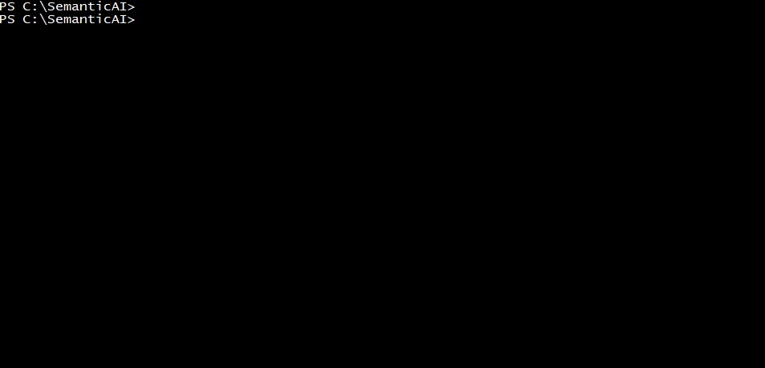

# SemanticAI

SemanticAI AI analytics application for estimation of relations between English words.


## Details

SemanticAI's core component is the WordNet structure which was central component of the IBM's Watson system as well. The main concept is the use of DAGs for building a hypernims structure of relations between words. This way the SemanticAI tool can provide insight into some abstract concepts, like how different are two words. A specific measure is used for that, which provides the **distance** between words. A more interesting concept is the closest **common ancestor** of both words. In addition it is possible to find an outlier using the Outlier tool, which means that the word which is mostly differentiated from all the other words provided is considered an outlier.

**Hypernims Example**


## Demo

> SemanticAI


> Outlier



## Package

- SemanticAI tool
- Outcast detector
- Test files are located in the test folder

## Usage

- CD to the `SemanticAI` folder.

- Compile
```shell
C:\SemanticAI> javac -cp "C:\SemanticAI;C:\SemanticAI\lib\algs4.jar" Outcast.java
C:\SemanticAI> javac -cp "C:\SemanticAI;C:\SemanticAI\lib\algs4.jar" SAP.java
C:\SemanticAI> javac -cp "C:\SemanticAI;C:\SemanticAI\lib\algs4.jar" SemanticAI.java

```

- Run using command line options:

```shell
C:\SemanticAI> java -cp "C:\SemanticAI;C:\SemanticAI;C:\SemanticAI\lib\algs4.jar" SemanticAI
```

> Outcast can use `-f` for file inputs and `-w` for words inputs

```shell
C:\SemanticAI> java -cp "C:\SemanticAI;C:\SemanticAI\test;C:\SemanticAI\lib\algs4.jar" Outcast -f outcast5.txt outcast8.txt
C:\SemanticAI> java -cp "C:\SemanticAI;C:\SemanticAI\test;C:\SemanticAI\lib\algs4.jar" Outcast -w horse zebra cat bear table

```
## How to Contribute

1. Clone repo and create a new branch: `$ git checkout https://github.com/DumitruHanciu/SemanticAI -b new_branch`.
2. Make changes and test
3. Submit Pull Request with comprehensive description of changes


## License

[](http://badges.mit-license.org)

- **[MIT license](http://opensource.org/licenses/mit-license.php)**
